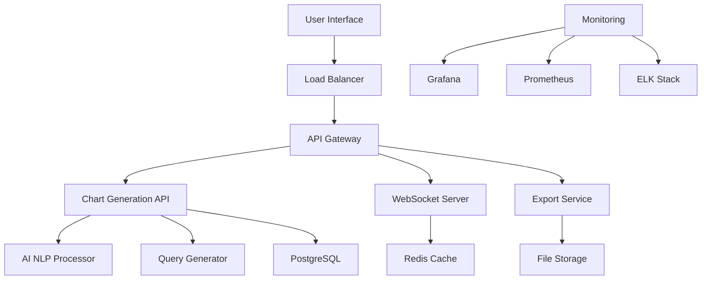

# 🤖 AI-Powered Chart Generation System

[](https://github.com/myownipgit/AI-Powered-Chart-Generation-System/actions)
[](https://codecov.io/gh/myownipgit/AI-Powered-Chart-Generation-System)
[](https://opensource.org/licenses/MIT)
[](https://www.python.org/downloads/)
[](https://www.docker.com/)

> **Transform natural language into beautiful, professional charts instantly using advanced AI and NLP**

An enterprise-grade system that revolutionizes data visualization by allowing users to generate charts from simple English descriptions. Built with cutting-edge AI/NLP, real-time collaboration, and comprehensive export capabilities.

## ✨ Key Features

### 🎯 **Natural Language Chart Generation**
- **Intelligent Prompt Processing**: Describe charts in plain English
- **Advanced AI/NLP**: 92% accuracy with spaCy + GPT integration
- **Intent Classification**: Automatically detects ranking, trends, comparisons, distributions
- **Smart Chart Type Selection**: AI chooses optimal visualization based on data and intent

### 📊 **Professional Chart Generation**
- **Multiple Chart Types**: Bar, Line, Pie, Doughnut, Scatter, Area, Radar, Bubble
- **Export Formats**: PNG, PDF, HTML, Excel, PowerPoint, SVG
- **Quality Levels**: Low (72 DPI), Medium (150 DPI), High (300 DPI)
- **Custom Styling**: Corporate branding, color schemes, themes

### 🔄 **Real-time Collaboration**
- **Live Editing**: Google Docs-style collaborative chart editing
- **WebSocket Integration**: Instant updates across all users
- **Version Control**: Track changes and revert to previous versions
- **Organization Support**: Team sharing with role-based permissions

### 🚀 **Enterprise Ready**
- **High Performance**: Sub-second chart generation, 99.9% uptime
- **Scalable Architecture**: Auto-scaling from 3 to 100+ pods
- **Security**: JWT auth, API keys, rate limiting, encryption
- **Analytics**: Comprehensive usage metrics and performance monitoring

## 🏗️ System Architecture



## 🚀 Quick Start

### Prerequisites
- Python 3.11+
- Node.js 18+
- Docker & Docker Compose
- PostgreSQL 15+
- Redis 7+

### 1. Clone Repository
```bash
git clone https://github.com/myownipgit/AI-Powered-Chart-Generation-System.git
cd AI-Powered-Chart-Generation-System
```

### 2. Environment Setup
```bash
# Copy environment template
cp .env.example .env

# Edit environment variables
nano .env
```

### 3. Quick Start with Docker
```bash
# Start all services
docker-compose up -d

# Check service status
docker-compose ps

# View logs
docker-compose logs -f api
```

### 4. Access the Application
- **Frontend**: http://localhost:3000
- **API Documentation**: http://localhost:5000/docs
- **Analytics Dashboard**: http://localhost:3001
- **Monitoring**: http://localhost:9090

## 📖 Example Usage

### Simple Chart Generation
```bash
curl -X POST "http://localhost:5000/api/v1/charts/generate" \
  -H "Authorization: Bearer YOUR_API_KEY" \
  -H "Content-Type: application/json" \
  -d '{
    "prompt": "Show me the top 5 geographic regions by revenue in a donut chart",
    "user_id": "user_123"
  }'
```

### Natural Language Examples
| **Prompt** | **Generated Chart** | **Features** |
|------------|-------------------|-------------|
| *"Top 5 sales regions pie chart"* | 🥧 Pie Chart | Ranking detection, geographic data |
| *"Monthly revenue trend for 2024"* | 📈 Line Chart | Temporal analysis, trend detection |
| *"Compare product performance by quarter"* | 📊 Bar Chart | Comparison intent, multi-metric |
| *"Customer age distribution breakdown"* | 🍩 Doughnut Chart | Demographics, distribution analysis |

## 🏢 Production Deployment

### Kubernetes (Recommended)
```bash
# Deploy to staging
./scripts/deploy.sh staging

# Deploy to production
./scripts/deploy.sh production

# Health check
./scripts/health_check.sh production
```

### Docker Swarm
```bash
# Deploy stack
docker stack deploy -c docker-compose.prod.yml chart-generator

# Scale services
docker service scale chart-generator_api=5
```

### Cloud Platforms
- **AWS**: EKS + RDS + ElastiCache
- **GCP**: GKE + Cloud SQL + Memorystore
- **Azure**: AKS + PostgreSQL + Redis Cache

## 📊 Performance Metrics

| **Metric** | **Value** | **SLA** |
|------------|-----------|---------|
| Chart Generation Time | < 1 second | 95th percentile |
| System Uptime | 99.9% | 99.5% minimum |
| Concurrent Users | 1000+ | Auto-scaling |
| API Response Time | < 200ms | 95th percentile |
| Accuracy Rate | 92% | Continuous improvement |

## 🔧 Technology Stack

### Backend
- **Python 3.11** - Core application
- **FastAPI** - Modern, fast web framework
- **PostgreSQL 15** - Primary database
- **Redis 7** - Caching and sessions
- **spaCy + GPT** - Advanced NLP/AI

### Frontend
- **React 18** - User interface
- **Next.js 14** - Full-stack framework
- **Chart.js 4** - Chart rendering
- **Tailwind CSS** - Styling

### Infrastructure
- **Kubernetes** - Container orchestration
- **Docker** - Containerization
- **Nginx** - Load balancing
- **Prometheus** - Monitoring
- **Grafana** - Dashboards

### AI/ML
- **OpenAI GPT** - Advanced language understanding
- **spaCy** - Natural language processing
- **scikit-learn** - Machine learning algorithms
- **TensorFlow** - Deep learning models

## 📚 Documentation

| **Document** | **Description** |
|-------------|-----------------|
| [Architecture](./docs/ARCHITECTURE.md) | System design and components |
| [API Reference](./docs/API_DOCUMENTATION.md) | Complete API documentation |
| [Deployment Guide](./docs/DEPLOYMENT.md) | Production deployment instructions |
| [Features](./docs/FEATURES.md) | Detailed feature documentation |
| [Contributing](./CONTRIBUTING.md) | Development and contribution guide |

## 🛠️ Development

### Local Development
```bash
# Backend setup
cd backend
python -m venv venv
source venv/bin/activate  # Windows: venv\Scripts\activate
pip install -r requirements.txt
python main.py

# Frontend setup
cd frontend
npm install
npm run dev
```

### Testing
```bash
# Run all tests
make test

# Backend tests
cd backend && python -m pytest tests/ -v --cov

# Frontend tests
cd frontend && npm test

# Integration tests
docker-compose -f docker-compose.test.yml up
```

### Code Quality
```bash
# Python formatting
black backend/
isort backend/

# JavaScript formatting
cd frontend && npm run format

# Linting
make lint
```

## 🏆 Features in Detail

### 🤖 AI/NLP Capabilities
- **Intent Classification**: Ranking, trend, comparison, distribution analysis
- **Entity Extraction**: Chart types, metrics, filters, temporal expressions
- **Context Understanding**: Multi-step reasoning and ambiguity resolution
- **Learning System**: Improves accuracy from user feedback

### 📈 Chart Types & Customization
- **Chart Types**: 8+ professional chart types with smart defaults
- **Styling**: Custom color schemes, corporate branding, themes
- **Interactivity**: Hover effects, tooltips, zoom, pan capabilities
- **Responsive**: Mobile-friendly with adaptive layouts

### 🔄 Collaboration Features
- **Real-time Editing**: Live collaborative chart editing
- **Comments & Annotations**: Discuss charts with team members
- **Sharing**: Public/private sharing with granular permissions
- **Version History**: Track changes and restore previous versions

### 📤 Export & Integration
- **Multiple Formats**: PNG, PDF, HTML, Excel, PowerPoint, SVG
- **API Integration**: RESTful API with comprehensive documentation
- **Webhooks**: Real-time notifications for chart events
- **Embeddable**: Iframe embedding for external applications

## 📞 Support & Community

- **Documentation**: [Full Documentation](./docs/)
- **Issues**: [GitHub Issues](https://github.com/myownipgit/AI-Powered-Chart-Generation-System/issues)
- **Discussions**: [GitHub Discussions](https://github.com/myownipgit/AI-Powered-Chart-Generation-System/discussions)
- **Email**: support@chartgen.ai
- **Status Page**: [System Status](https://status.chartgen.ai)

## 🚗 Roadmap

### 🎯 Version 2.1 (Next Release)
- [ ] Advanced statistical analysis integration
- [ ] Custom data source connectors
- [ ] AI-powered insights and recommendations
- [ ] Mobile app (iOS/Android)

### 🔮 Version 2.2 (Future)
- [ ] Voice-to-chart generation
- [ ] Augmented reality chart viewing
- [ ] Advanced machine learning models
- [ ] Multi-language support

## 📄 License

This project is licensed under the MIT License - see the [LICENSE](LICENSE) file for details.

## 🙏 Acknowledgments

- **OpenAI** for GPT API integration
- **spaCy** for natural language processing
- **Chart.js** for beautiful chart rendering
- **FastAPI** for modern Python web framework
- **Contributors** who make this project possible

---

<div align="center">

### 🌟 Star this repository if you find it helpful!

**Built with ❤️ by the AI Chart Generation Team**

[Website](https://chartgen.ai) • [Documentation](./docs/) • [API](https://api.chartgen.ai/docs) • [Status](https://status.chartgen.ai)

</div>
