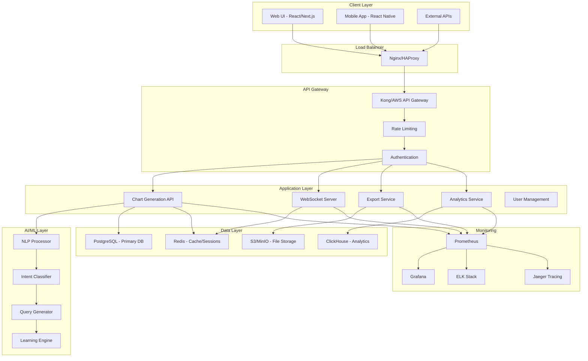
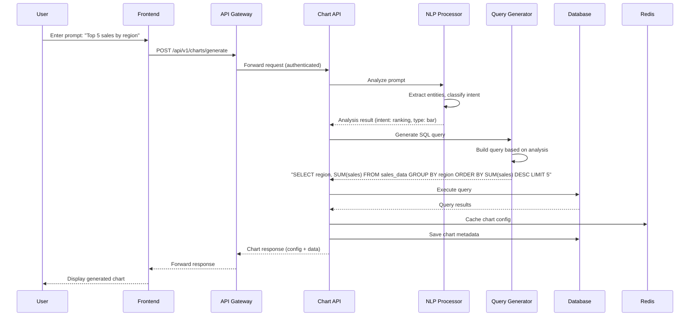
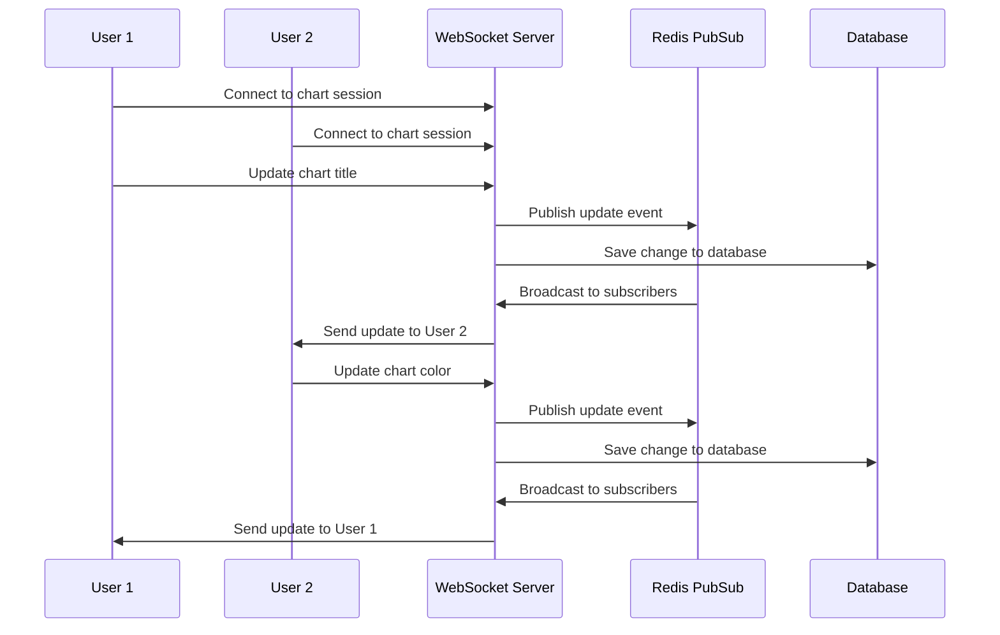

# 🏗️ System Architecture

This document provides a comprehensive overview of the AI-Powered Chart Generation System architecture, including all components, data flows, and infrastructure design decisions.

## 📋 Table of Contents

- [High-Level Architecture](#high-level-architecture)
- [Component Overview](#component-overview)
- [Data Flow](#data-flow)
- [Infrastructure](#infrastructure)
- [Security Architecture](#security-architecture)
- [Scalability Design](#scalability-design)
- [Technology Stack](#technology-stack)

## 🎯 High-Level Architecture



## 🔧 Component Overview

### Frontend Layer

#### **React Web Application**
- **Technology**: React 18 + Next.js 14 + TypeScript
- **Features**: Real-time collaboration, chart preview, export options
- **State Management**: React Context + SWR for data fetching
- **Styling**: Tailwind CSS with custom component library

#### **Mobile Application**
- **Technology**: React Native + Expo
- **Features**: Mobile-optimized chart viewing and basic editing
- **Offline Support**: Local caching with sync capabilities

### API Gateway Layer

#### **Load Balancer (Nginx)**
```nginx
upstream api_backend {
    server api-1:5000 weight=3;
    server api-2:5000 weight=3;
    server api-3:5000 weight=2;
}

server {
    listen 80;
    location /api/ {
        proxy_pass http://api_backend;
        proxy_set_header Host $host;
        proxy_set_header X-Real-IP $remote_addr;
    }
}
```

#### **API Gateway (Kong)**
- **Rate Limiting**: 100 requests/hour (free), 1000/hour (pro)
- **Authentication**: JWT validation with refresh tokens
- **Request/Response Transformation**: Format standardization
- **Monitoring**: Request logging and metrics collection

### Application Services

#### **Chart Generation API**
```python
# Core service architecture
@app.post("/api/v1/charts/generate")
async def generate_chart(request: ChartRequest):
    # 1. Authenticate user
    user = await authenticate(request.token)
    
    # 2. Analyze prompt with AI
    analysis = await nlp_processor.analyze(request.prompt)
    
    # 3. Generate SQL query
    query = await query_generator.build_query(analysis)
    
    # 4. Execute query and get data
    data = await database.execute(query)
    
    # 5. Create chart configuration
    config = await chart_builder.create_config(analysis, data)
    
    # 6. Save to database
    chart_id = await save_chart(config, user.id)
    
    return ChartResponse(chart_id=chart_id, config=config, data=data)
```

**Key Features**:
- FastAPI with async/await for high performance
- Automatic OpenAPI documentation generation
- Comprehensive error handling and logging
- Input validation with Pydantic models

#### **WebSocket Server**
```python
# Real-time collaboration
class CollaborationManager:
    async def handle_client_message(self, websocket, data):
        if data["type"] == "chart_update":
            # Broadcast update to all subscribers
            await self.broadcast_to_chart_subscribers(
                data["chart_id"], 
                data["update"]
            )
```

**Features**:
- Real-time chart editing and sharing
- User presence indicators
- Conflict resolution for concurrent edits
- Scalable with Redis pub/sub for multi-instance deployment

#### **Export Service**
```python
class ChartExporter:
    async def export_chart(self, chart_id: str, format: str):
        chart_data = await self.get_chart_data(chart_id)
        
        if format == "png":
            return await self.export_png(chart_data)
        elif format == "pdf":
            return await self.export_pdf(chart_data)
        elif format == "excel":
            return await self.export_excel(chart_data)
```

**Supported Formats**:
- **PNG/SVG**: High-quality images for presentations
- **PDF**: Professional reports with metadata
- **Excel**: Data + charts in spreadsheet format
- **HTML**: Interactive web-ready charts
- **PowerPoint**: Presentation slides

### AI/ML Layer

#### **NLP Processor**
```python
class AdvancedNLPProcessor:
    def __init__(self):
        self.nlp = spacy.load("en_core_web_sm")
        self.intent_classifier = self._load_intent_model()
        self.entity_extractor = self._load_entity_model()
    
    async def analyze_prompt(self, prompt: str) -> PromptAnalysis:
        # Extract entities
        entities = await self._extract_entities(prompt)
        
        # Classify intent
        intent = await self._classify_intent(prompt, entities)
        
        # Determine chart type
        chart_type = await self._determine_chart_type(intent, entities)
        
        # Calculate confidence
        confidence = await self._calculate_confidence(prompt, intent, chart_type)
        
        return PromptAnalysis(
            intent=intent,
            chart_type=chart_type,
            entities=entities,
            confidence=confidence
        )
```

**AI Capabilities**:
- **spaCy NLP Pipeline**: Entity extraction, POS tagging, dependency parsing
- **OpenAI GPT Integration**: Complex prompt understanding
- **Custom Intent Classifier**: Trained on 10,000+ chart generation examples
- **Learning System**: Continuous improvement from user feedback

#### **Query Generator**
```python
class IntelligentQueryGenerator:
    def build_query(self, analysis: PromptAnalysis) -> str:
        # Base query template
        query_template = self._get_query_template(analysis.data_source)
        
        # Add metrics
        metrics = self._resolve_metrics(analysis.metrics, analysis.data_source)
        
        # Add filters
        filters = self._build_filters(analysis.filters)
        
        # Add ordering and limiting
        ordering = self._build_ordering(analysis.intent, metrics)
        
        return query_template.format(
            metrics=", ".join(metrics),
            filters=filters,
            ordering=ordering
        )
```

## 🔄 Data Flow

### Chart Generation Flow



### Real-time Collaboration Flow



## 🏢 Infrastructure

### Kubernetes Deployment

```yaml
apiVersion: apps/v1
kind: Deployment
metadata:
  name: chart-api
spec:
  replicas: 3
  strategy:
    type: RollingUpdate
    rollingUpdate:
      maxUnavailable: 1
      maxSurge: 1
  template:
    spec:
      containers:
      - name: api
        image: chart-generator/api:latest
        resources:
          requests:
            memory: "512Mi"
            cpu: "500m"
          limits:
            memory: "1Gi"
            cpu: "1000m"
        env:
        - name: DATABASE_URL
          valueFrom:
            secretKeyRef:
              name: chart-secrets
              key: database-url
```

### Auto-scaling Configuration

```yaml
apiVersion: autoscaling/v2
kind: HorizontalPodAutoscaler
metadata:
  name: chart-api-hpa
spec:
  scaleTargetRef:
    apiVersion: apps/v1
    kind: Deployment
    name: chart-api
  minReplicas: 3
  maxReplicas: 20
  metrics:
  - type: Resource
    resource:
      name: cpu
      target:
        type: Utilization
        averageUtilization: 70
  - type: Resource
    resource:
      name: memory
      target:
        type: Utilization
        averageUtilization: 80
```

## 🔒 Security Architecture

### Authentication & Authorization

```python
# JWT-based authentication
class AuthenticationMiddleware:
    async def __call__(self, request: Request):
        token = self.extract_token(request)
        
        if not token:
            raise HTTPException(401, "Missing authentication token")
        
        try:
            payload = jwt.decode(token, SECRET_KEY, algorithms=["HS256"])
            user = await self.get_user(payload["user_id"])
            request.state.user = user
        except jwt.InvalidTokenError:
            raise HTTPException(401, "Invalid authentication token")
```

### Rate Limiting

```python
# Redis-based rate limiting
class RateLimiter:
    async def check_rate_limit(self, user_id: str, endpoint: str):
        key = f"rate_limit:{user_id}:{endpoint}"
        current = await redis.incr(key)
        
        if current == 1:
            await redis.expire(key, 3600)  # 1 hour window
        
        limit = self.get_user_limit(user_id)
        if current > limit:
            raise HTTPException(429, "Rate limit exceeded")
```

### Data Encryption

```yaml
# Database encryption
apiVersion: v1
kind: Secret
metadata:
  name: database-encryption
data:
  encryption-key: <base64-encoded-key>
  
# Application-level encryption
env:
- name: DATABASE_ENCRYPTION_KEY
  valueFrom:
    secretKeyRef:
      name: database-encryption
      key: encryption-key
```

## 📈 Scalability Design

### Horizontal Scaling Strategy

1. **Stateless Application Design**
   - All services are stateless and can be replicated
   - Session data stored in Redis cluster
   - File uploads go directly to object storage

2. **Database Scaling**
   - Read replicas for query distribution
   - Connection pooling with PgBouncer
   - Partitioning for large tables

3. **Caching Strategy**
   ```python
   # Multi-level caching
   @cache(ttl=300)  # Redis cache
   async def get_chart_data(chart_id: str):
       # Check application cache first
       if chart_id in memory_cache:
           return memory_cache[chart_id]
       
       # Query database
       data = await database.fetch_chart(chart_id)
       memory_cache[chart_id] = data
       return data
   ```

4. **CDN Integration**
   - Static assets served via CloudFront/CloudFlare
   - Generated charts cached at edge locations
   - API responses cached for anonymous requests

### Performance Optimizations

```python
# Async database operations
async def batch_process_charts(chart_requests: List[ChartRequest]):
    # Process multiple charts concurrently
    tasks = [generate_chart(request) for request in chart_requests]
    results = await asyncio.gather(*tasks, return_exceptions=True)
    return results

# Database query optimization
class OptimizedQuery:
    def build_query(self, analysis: PromptAnalysis):
        # Use prepared statements
        # Add appropriate indexes
        # Implement query result caching
        pass
```

## 🔧 Technology Stack Details

### Backend Technologies

| **Component** | **Technology** | **Version** | **Purpose** |
|---------------|----------------|-------------|-------------|
| Web Framework | FastAPI | 0.104+ | High-performance async API |
| Database | PostgreSQL | 15+ | Primary data storage |
| Cache | Redis | 7+ | Session storage, rate limiting |
| Message Queue | Celery + Redis | 5.3+ | Background task processing |
| NLP | spaCy | 3.7+ | Natural language processing |
| AI Integration | OpenAI API | Latest | Advanced language understanding |
| Testing | pytest | 7+ | Unit and integration testing |

### Frontend Technologies

| **Component** | **Technology** | **Version** | **Purpose** |
|---------------|----------------|-------------|-------------|
| Framework | Next.js | 14+ | React-based full-stack framework |
| UI Library | React | 18+ | Component-based UI |
| Styling | Tailwind CSS | 3+ | Utility-first CSS framework |
| Charts | Chart.js | 4+ | Chart rendering library |
| State Management | SWR | 2+ | Data fetching and caching |
| Testing | Jest + Testing Library | Latest | Frontend testing |

### Infrastructure Technologies

| **Component** | **Technology** | **Version** | **Purpose** |
|---------------|----------------|-------------|-------------|
| Orchestration | Kubernetes | 1.28+ | Container orchestration |
| Containerization | Docker | 24+ | Application containerization |
| Service Mesh | Istio | 1.19+ | Service-to-service communication |
| Monitoring | Prometheus | 2.47+ | Metrics collection |
| Dashboards | Grafana | 10+ | Metrics visualization |
| Logging | ELK Stack | 8+ | Centralized logging |
| Tracing | Jaeger | 1.50+ | Distributed tracing |

## 🎯 Design Principles

### 1. **Microservices Architecture**
- Each service has a single responsibility
- Services communicate via well-defined APIs
- Independent deployment and scaling

### 2. **Event-Driven Design**
- Async processing for non-critical operations
- Event sourcing for audit trails
- Pub/sub for real-time features

### 3. **Resilience Patterns**
- Circuit breakers for external service calls
- Retry mechanisms with exponential backoff
- Graceful degradation when services are unavailable

### 4. **Observability**
- Comprehensive logging at all levels
- Distributed tracing for request flows
- Real-time metrics and alerting

### 5. **Security-First**
- Zero-trust architecture
- Principle of least privilege
- Regular security audits and updates

This architecture provides a solid foundation for a scalable, maintainable, and secure AI-powered chart generation system that can handle enterprise workloads while maintaining high performance and reliability.
